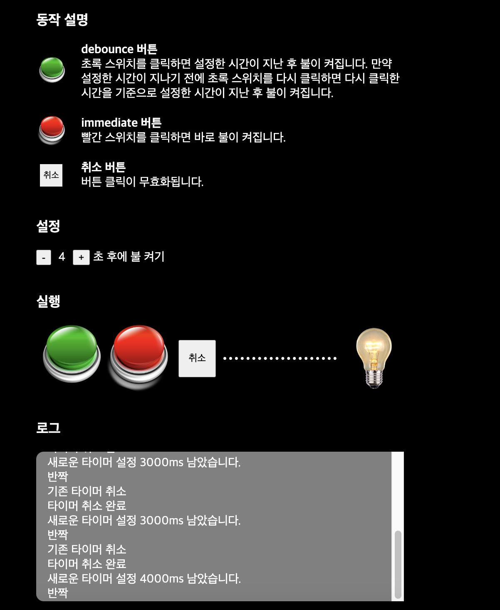

# Debouncing

> debouncing을 적용한 예제를 담은 데모 사이트입니다.
> [바로 가기](http://biblek-debouncing.netlify.app)

<h2>
    1. 개발 환경
</h2>

#### Front-End

- React
- typescript
- styled-components
- react-code-blocks
- recoil

<h2 id="installation">
    2. 설치 및 실행 방법
</h2>

```javascript
// install dependency
$> npm install

// run app
$> npm start
```

<h2>
    3. useDebounce
</h2>

#### PARAMETERS

| PARAMETERS | type     | description                           |
| ---------- | -------- | ------------------------------------- |
| func       | Function | 디바운스를 적용할 함수                |
| wait       | number   | 밀리초 단위의 지연 시간. 기본 값은 0. |
| immediate  | boolean  | 즉시 실행 옵션. 기본값은 false.       |

#### RETURN VALUES

| Property  | type                             | description                                         |
| --------- | -------------------------------- | --------------------------------------------------- |
| debounced | (...args: any[]) => Promise<any> | 디바운스 된 함수이며 실행 시 프로미스를 반환합니다. |
| cancel    | () => void                       | 디바운싱을 취소하고 타이머를 삭제하는 함수입니다.   |

<h2>
    4. 데모사이트에서 적용한 예제
</h2>
버튼을 클릭하여 전구에 불을 켤 수 있습니다.
모든 버튼은 useDebounce를 사용하여 동작합니다.

useDebounce의 실행 현황 관찰을 위해 로그를 기록하였습니다.


